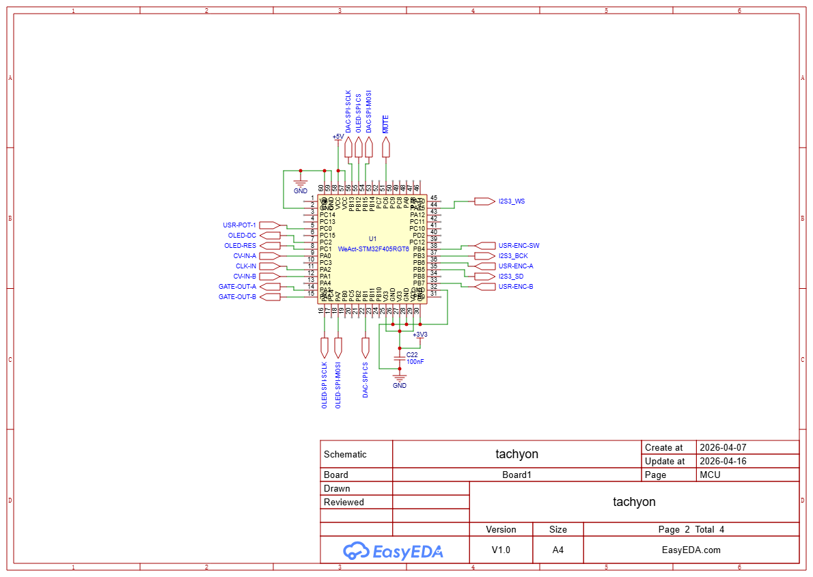
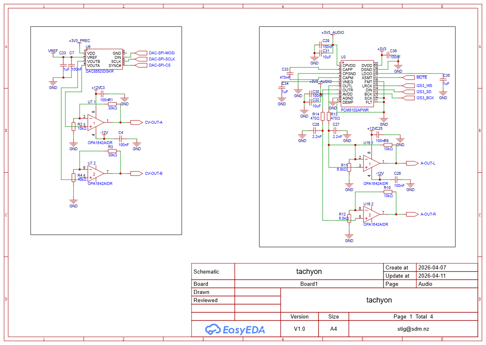
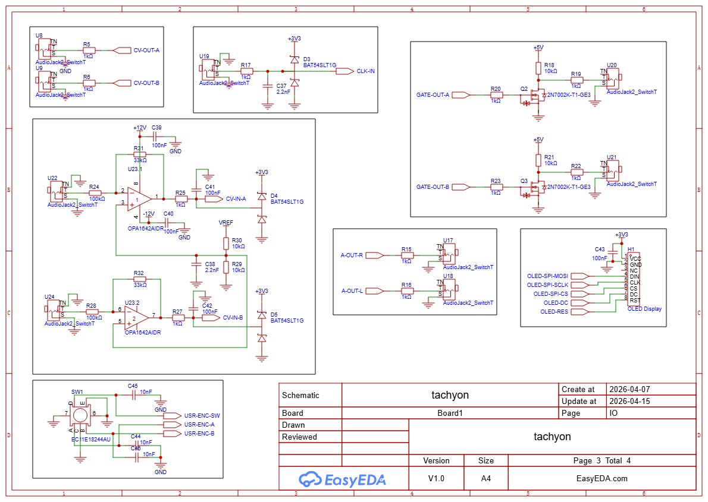

# Tachyon

An open-hardware Eurorack step sequencer with onboard voice, built
around the STM32F405RGT6 (WeAct core board). Tachyon generates two
precision 1 V/oct CV outputs plus two output audio channels, navigated via
single rotary encoder and a 128×128 OLED.

## At a glance

| | |
|---|---|
| **MCU** | STM32F405RGT6 @ 168 MHz (WeAct 64-pin core board) |
| **CV outputs** | 2 × 16-bit, 0–10 V, 1 V/oct, DAC8552 + OPA1642 ×4 |
| **Audio output** | Stereo I²S, PCM5102A DirectPath |
| **Display** | 1.5″ 128×128 OLED (SH1107, SPI) |
| **Input** | Alps Alpine EC11E18244AU rotary encoder with push switch |
| **MIDI** | USB MIDI class device over the WeAct USB-C port |
| **Power** | 10-pin Doepfer header, ±12 V only (local +5 V buck) |
| **Format** | Eurorack, ~12–14 HP |

### High-level design

- **[hardware-design-plan.md](hardware-design-plan.md)** — the master
  hardware plan. MCU pin budget, peripheral selection, input /
  display / DAC / op-amp choices with rationale.

  

### Subsystem specs

These are schematic specs — per-pin connections,
decoupling BOMs:

- **[cv-output-dac.md](cv-output-dac.md)** — precision CV chain:
  DAC8552 (U6) + REF5025 (U2) + OPA1642 (U7), ×4 non-inverting gain
  stage producing 0–10 V at 1 V/oct, with feedback-tap and
  output-protection rules.

- **[audio-output-dac.md](audio-output-dac.md)** — stereo audio
  chain: PCM5102A (U3) on I²S3, DirectPath outputs to two TS jacks,
  `~MUTE` line, and per-pin decoupling.

  
- **[power-supply.md](power-supply.md)** — full power tree: +12 V
  input protection, +12 V → +5 V buck (TPS54202), the two
  TPS7A2033 low-noise LDOs for `+3V3_PREC` and `+3V3_AUDIO`, and
  the rail current budget.

  

### Physical design

- **[pcb-design.md](pcb-design.md)** — PCB stackup, ground plane
  rules (one continuous L2 plane, no splits), power pour regions,
  placement zones, and signal routing guidance.

### Bring-up

- **[calibration.md](calibration.md)** — one-time CV output
  calibration procedure (two-point slope/offset fit against a DMM)
  for the precision DAC path.

### Datasheets

The [`datasheets/`](datasheets/) folder holds per-part markdown
summaries (pinout, key electrical specs, application notes)
extracted from the manufacturer PDFs for every non-passive component
in the BOM. The PDFs live alongside each `.md` summary. Root-level
docs cite these with paths like `DAC8552.md:72` when a specific
paragraph matters.

### Firmware

- **[firmware/README.md](firmware/README.md)** — DFU flashing
  instructions and firmware build notes.

## Licence

Hardware (schematics, PCB, mechanical) is licensed under the
[CERN Open Hardware Licence Version 2 — Strongly Reciprocal](LICENSE)
(CERN-OHL-S v2).

Firmware (everything under [`firmware/`](firmware/)) is licensed
separately under the [MIT License](firmware/LICENSE).

Copyright © 2026 Stig Manning.
