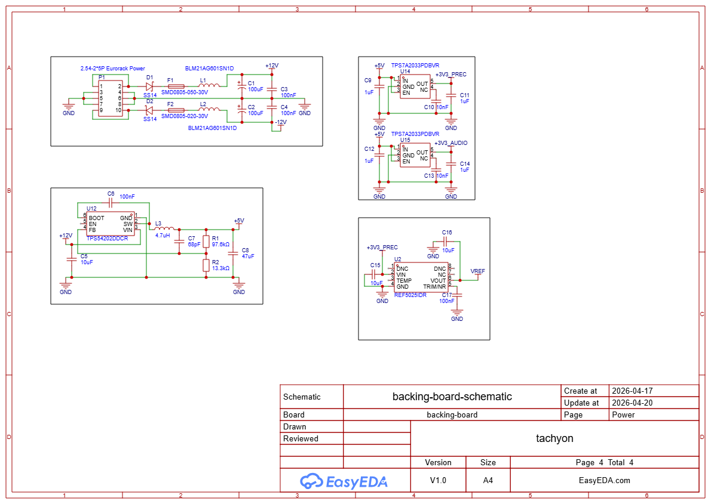
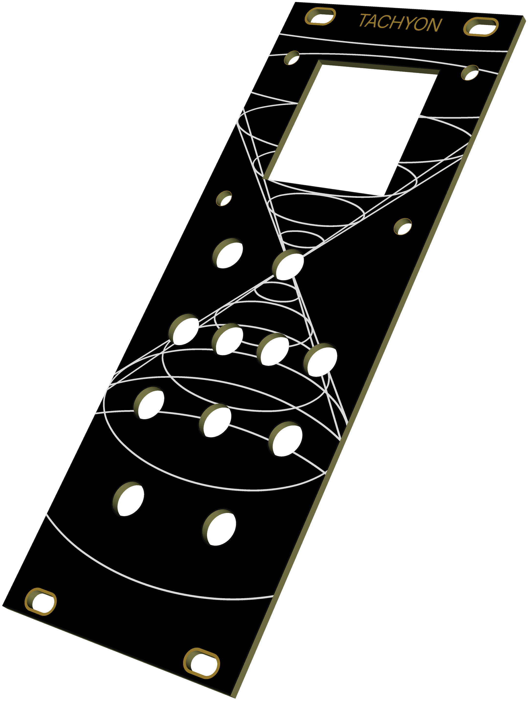
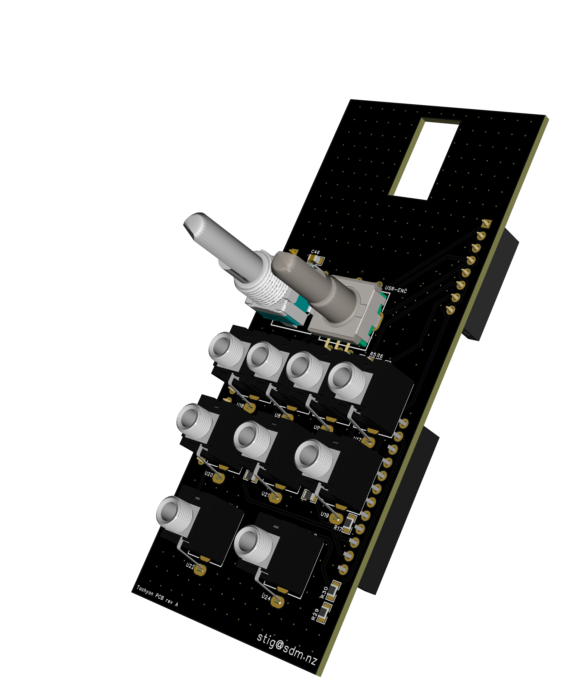
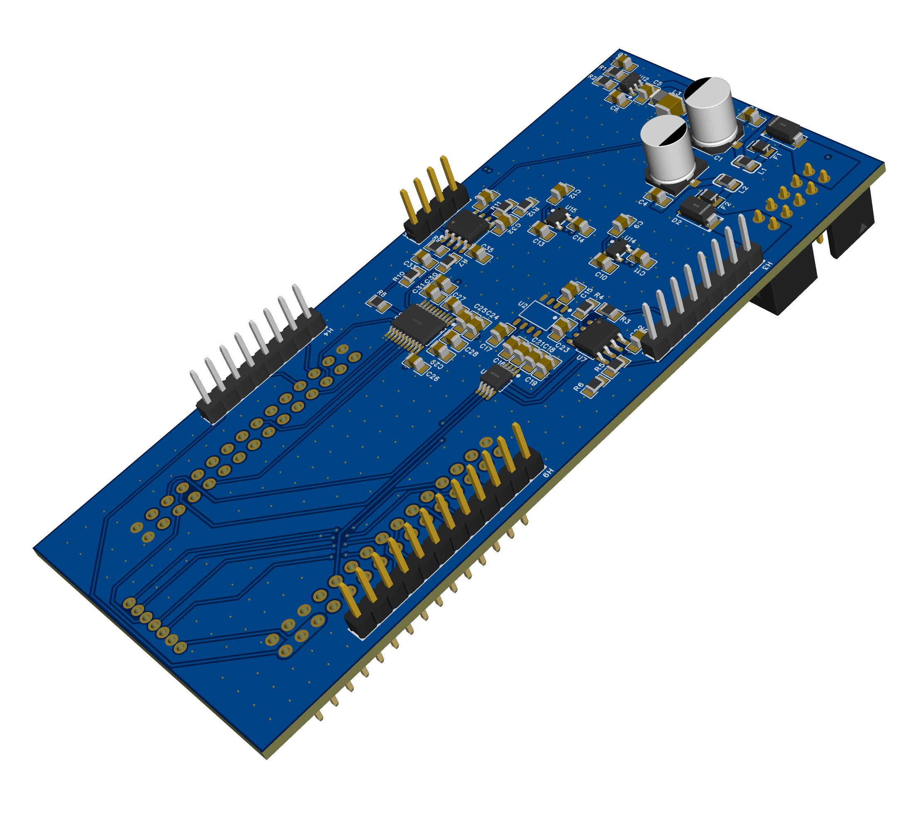

# Tachyon

An open-hardware Eurorack step sequencer with onboard voice, built
around the STM32F405RGT6 (WeAct core board). Tachyon generates two
precision 1 V/oct CV outputs, two +5 V gate outputs, and a stereo
audio pair, accepts two CV modulation inputs and an external clock,
and is navigated via a rotary encoder, a panel pot, and a 128×128
OLED.

## At a glance

| | |
|---|---|
| **MCU** | STM32F405RGT6 @ 168 MHz (WeAct 64-pin core board), 1 MB Flash, 192 KB RAM |
| **Storage** | MicroSD slot on the WeAct board (SDIO 4-bit) |
| **CV outputs** | 2 × 16-bit, 0–10 V, 1 V/oct, DAC8552 + OPA1642 ×4 |
| **Gate outputs** | 2 × 0/+5 V, 2N7002K level shift |
| **CV inputs** | 2 × bipolar modulation, OPA1642 attenuator → ADC1 |
| **Clock input** | +5 V trigger, TIM2 input capture (with internal BPM fallback) |
| **Audio output** | Stereo I²S, PCM5102A DirectPath |
| **Display** | 1.5″ 128×128 OLED (SSD1327, 4-bit grayscale, SPI) |
| **Controls** | Alps EC11E rotary encoder w/ push switch + Alps 100K pot |
| **USB** | USB-C on the WeAct board — USB MIDI class device, DFU flashing |
| **Power** | 10-pin Doepfer header, ±12 V only (local +5 V buck) |
| **Format** | Eurorack, 10 HP, 3-board sandwich (front / IO / backing) |

### High-level design

- **[hardware-design-plan.md](hardware-design-plan.md)** — the master
  hardware plan. MCU pin budget, peripheral selection, input /
  display / DAC / op-amp choices with rationale.

  

### Subsystem specs

These are schematic specs — per-pin connections,
decoupling BOMs:

- **[cv-output-dac.md](cv-output-dac.md)** — precision CV chain:
  DAC8552 (U6) + REF5025 (U2) + OPA1642 (U7), ×4 non-inverting gain
  stage producing 0–10 V at 1 V/oct, with feedback-tap and
  output-protection rules.

- **[cv-input.md](cv-input.md)** — 2 × bipolar Eurorack CV jacks
  through an OPA1642 (U23) inverting attenuator + 1.25 V bias stage
  into ADC1 (PA0/PA1), with BAT54S input clamping.

- **[gate-output.md](gate-output.md)** — 2 × 0/+5 V gate/trigger
  outputs via 2N7002K MOSFET inverting drivers with pull-ups to the
  +5 V rail.

- **[clock-input.md](clock-input.md)** — external +5 V clock jack
  routed to TIM2 input capture (PA2) with the same BAT54S clamp;
  firmware-generated BPM clock as the internal fallback.

  

- **[audio-output-dac.md](audio-output-dac.md)** — stereo audio
  chain: PCM5102A (U3) on I²S3, DirectPath outputs to two TS jacks,
  `~MUTE` line, and per-pin decoupling.

  

- **[user-interface.md](user-interface.md)** — front-panel I/O:
  SSD1327 OLED on dedicated SPI1, Alps EC11E quadrature encoder on
  TIM4 with EXTI push-switch, and a 100 K Alps pot into ADC1.

- **[power-supply.md](power-supply.md)** — full power tree: +12 V
  input protection, +12 V → +5 V buck (TPS54202), the two
  TPS7A2033 low-noise LDOs for `+3V3_PREC` and `+3V3_AUDIO`, and
  the rail current budget.

  

### Physical design

The module is a three-PCB sandwich: a **front** board (panel
graphics, no electrical content), an **IO** board (panel-side
jacks, pot, encoder, and OLED ribbon connector), and a **backing**
board (the dense analog/digital board with the buck, LDOs,
references, DACs, op-amps, and the WeAct STM32 module on its
bottom side). The boards mate via inter-board pin headers.

- **[pcb-design.md](pcb-design.md)** — PCB stackup, ground plane
  rules (one continuous Layer 2 plane, no splits), power pour
  regions, placement zones, and signal routing guidance for the
  backing board, plus the inter-board header map.

  

  

  

### Manufacturing outputs

The [`gerber/`](gerber/) folder holds the latest fab/assembly
exports for all three boards: Gerber zips, Allegro Telesis (`.tel`)
netlists, and pick-and-place CSVs, plus the per-board audit reports
(`audit-front-board.md`, `audit-io-board.md`,
`audit-backing-board.md`) that cross-check each export against the
design docs. Combined per-board schematic PDFs live at the repo
root: [`io-board-schematic.pdf`](io-board-schematic.pdf),
[`mcu-audio-board-schematic.pdf`](mcu-audio-board-schematic.pdf).
The EasyEDA Pro source project is [`tachyon.eprj`](tachyon.eprj).

### Bring-up

- **[calibration.md](calibration.md)** — one-time CV output
  calibration procedure (two-point slope/offset fit against a DMM)
  for the precision DAC path.

### Datasheets

The [`datasheets/`](datasheets/) folder holds per-part markdown
summaries (pinout, key electrical specs, application notes)
extracted from the manufacturer PDFs for every non-passive component
in the BOM. The PDFs live alongside each `.md` summary. Root-level
docs cite these with paths like `DAC8552.md:72` when a specific
paragraph matters.

### Firmware

- **[firmware/README.md](firmware/README.md)** — DFU flashing
  instructions and firmware build notes.

## Licence

Hardware (schematics, PCB, mechanical) is licensed under the
[CERN Open Hardware Licence Version 2 — Strongly Reciprocal](LICENSE)
(CERN-OHL-S v2).

Firmware (everything under [`firmware/`](firmware/)) is licensed
separately under the [MIT License](firmware/LICENSE).

Copyright © 2026 Stig Manning.
