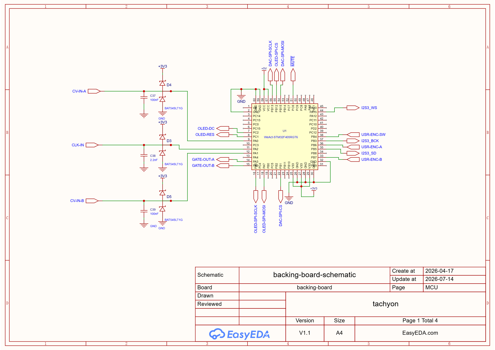
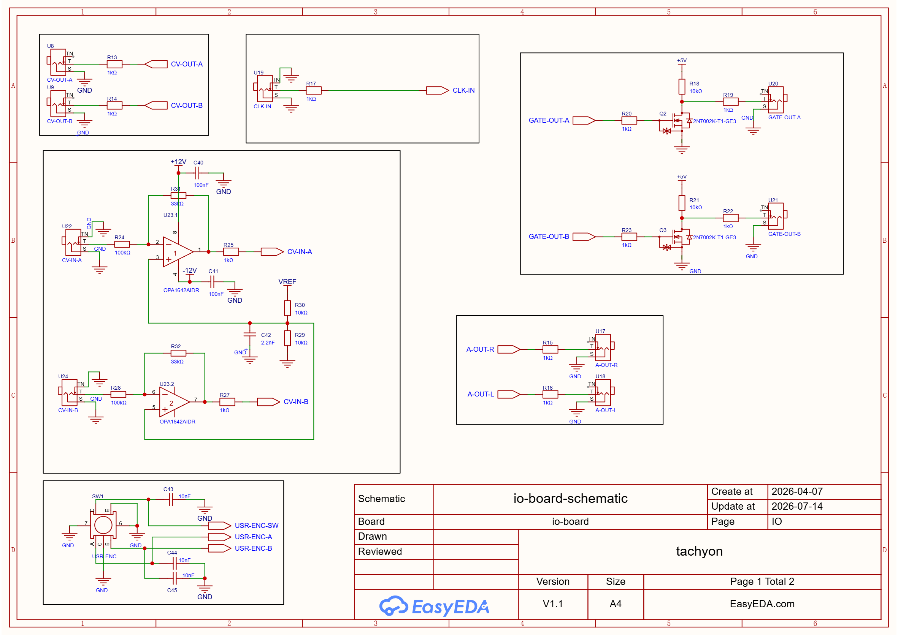
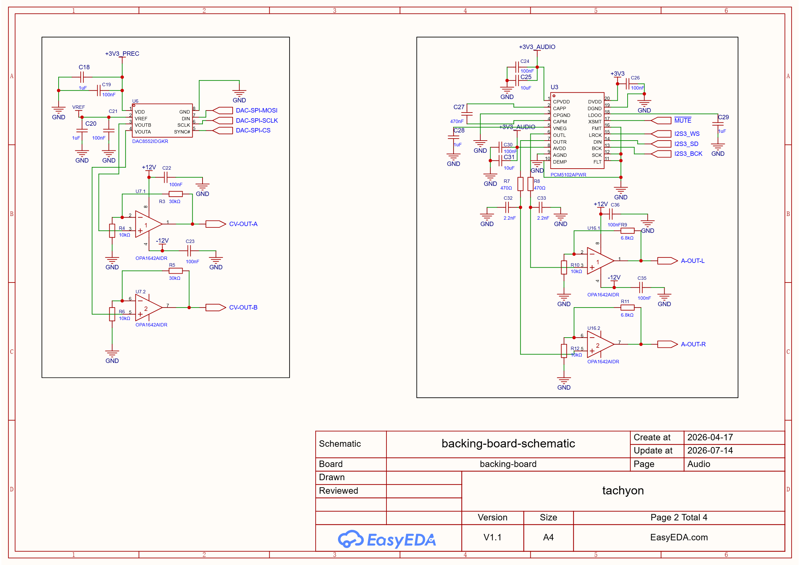
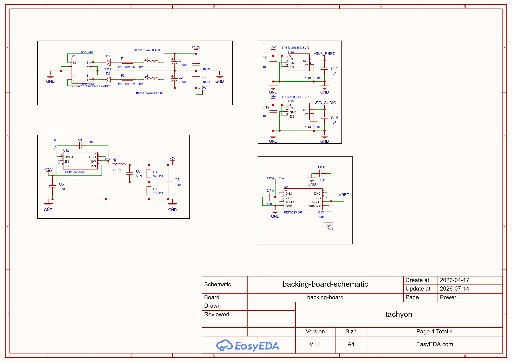
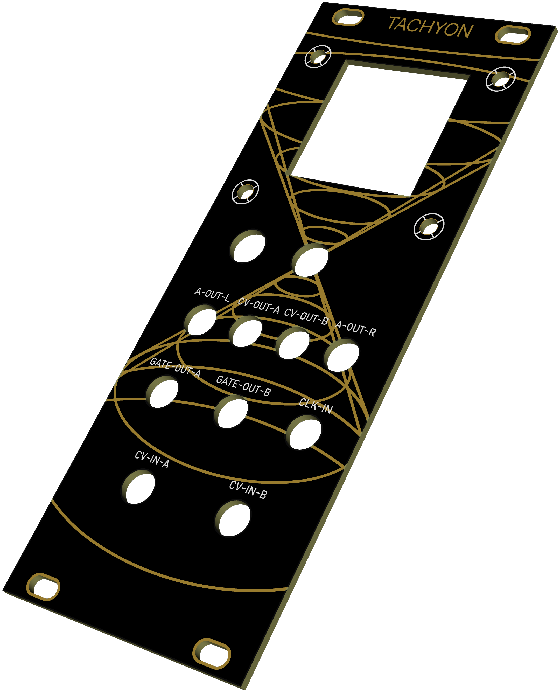
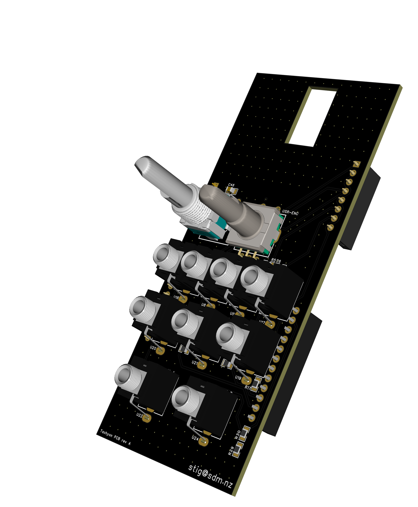
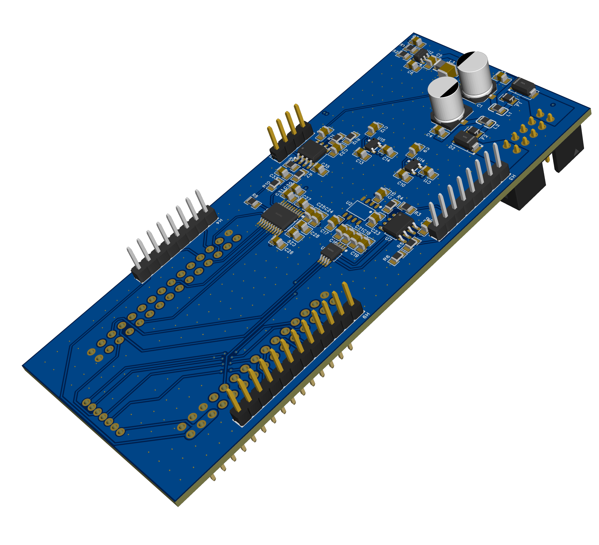

# Tachyon

An open-hardware Eurorack step sequencer with an onboard **wavetable
voice**, built around the STM32F405RGT6 (WeAct core board). Tachyon plays
single-cycle wavetables loaded from a microSD card (Korg
`.korgmultisample` format), driven by a circle-of-fifths key/chord
arpeggiator or by a USB-MIDI host. It generates two precision 1 V/oct CV
outputs, two +5 V gate outputs, and two audio outputs, accepts two CV
modulation inputs and an external clock, and is navigated via a rotary
encoder, a parameter adjustment pot, and a 128×128 OLED screen.

## At a glance

| | |
|---|---|
| **MCU** | STM32F405RGT6 @ 168 MHz (WeAct 64-pin core board), 1 MB Flash, 192 KB RAM |
| **Storage** | MicroSD slot on the WeAct board (SDIO 4-bit) |
| **CV outputs** | 2 × 16-bit, 0–10 V, 1 V/oct, DAC8552 + OPA1642 ×4 |
| **Gate outputs** | 2 × 0/+5 V, 2N7002K level shift |
| **CV inputs** | 2 × bipolar modulation, OPA1642 attenuator → ADC1 |
| **Clock input** | +5 V trigger, TIM2 input capture (with internal BPM fallback) |
| **Audio output** | Stereo I²S, PCM5102A DirectPath |
| **Display** | 1.5″ 128×128 OLED (SSD1327, 4-bit grayscale, SPI) |
| **Controls** | Alps EC11E rotary encoder w/ push switch + Alps 100K pot |
| **USB** | USB-C on the WeAct board — USB MIDI class device, DFU flashing |
| **Power** | 10-pin Doepfer header, ±12 V only (local +5 V buck) |
| **Format** | Eurorack, 10 HP, 3-board sandwich (front / IO / backing) |

### High-level design

- **[hardware-design-plan.md](hardware-design-plan.md)** — the master
  hardware plan. MCU pin budget, peripheral selection, input /
  display / DAC / op-amp choices with rationale.

  

### Subsystem specs

These are schematic specs — per-pin connections,
decoupling BOMs:

- **[cv-output-dac.md](cv-output-dac.md)** — precision CV chain:
  DAC8552 (U6) + REF5025 (U2) + OPA1642 (U7), ×4 non-inverting gain
  stage producing 0–10 V at 1 V/oct, with feedback-tap and
  output-protection rules.

- **[cv-input.md](cv-input.md)** — 2 × bipolar Eurorack CV jacks
  through an OPA1642 (U23) inverting attenuator + 1.25 V bias stage
  into ADC1 (PA0/PA1), with BAT54S input clamping.

- **[gate-output.md](gate-output.md)** — 2 × 0/+5 V gate/trigger
  outputs via 2N7002K MOSFET inverting drivers with pull-ups to the
  +5 V rail.

- **[clock-input.md](clock-input.md)** — external +5 V clock jack
  routed to TIM2 input capture (PA2) with the same BAT54S clamp;
  firmware-generated BPM clock as the internal fallback.

  

- **[audio-output-dac.md](audio-output-dac.md)** — stereo audio
  chain: PCM5102A (U3) on I²S3, DirectPath outputs to two TS jacks,
  `~MUTE` line, and per-pin decoupling.

  

- **[user-interface.md](user-interface.md)** — front-panel I/O:
  SSD1327 OLED on dedicated SPI1, Alps EC11E quadrature encoder on
  TIM4 with EXTI push-switch, and a 100 K Alps pot into ADC1.

- **[power-supply.md](power-supply.md)** — full power tree: +12 V
  input protection, +12 V → +5 V buck (TPS54202), the two
  TPS7A2033 low-noise LDOs for `+3V3_PREC` and `+3V3_AUDIO`, and
  the rail current budget.

  

### Physical design

The module is a three-PCB sandwich: a **front** board (panel
graphics, no electrical content), an **IO** board (panel-side
jacks, pot, encoder, and OLED ribbon connector), and a **backing**
board (the dense analog/digital board with the buck, LDOs,
references, DACs, op-amps, and the WeAct STM32 module on its
bottom side). The boards mate via inter-board pin headers.

- **[pcb-design.md](pcb-design.md)** — PCB stackup, ground plane
  rules (one continuous Layer 2 plane, no splits), power pour
  regions, placement zones, and signal routing guidance for the
  backing board, plus the inter-board header map.

  

  

  

### Manufacturing outputs

The [`gerber/`](gerber/) folder holds the latest fab/assembly
exports for all three boards, plus the per-board audit reports
([`audit-front-board.md`](gerber/audit-front-board.md),
[`audit-io-board.md`](gerber/audit-io-board.md),
[`audit-backing-board.md`](gerber/audit-backing-board.md))
created by the included [`pcb-designer`](.claude/skills/pcb-designer/)
skill for Claude that cross-check each export against the design
docs. Combined per-board schematic PDFs live at the repo root:
[`io-board-schematic.pdf`](io-board-schematic.pdf),
[`mcu-audio-board-schematic.pdf`](mcu-audio-board-schematic.pdf).
The EasyEDA Pro source project is [`tachyon.eprj`](tachyon.eprj).

### Ordering PCBs

Using EasyEDA you can order direct with JLCPCB, but
[PCBWay](https://www.pcbway.com/) also provide excellent
high-quality PCB manufacturing, with a choice of 9 different
solder mask colors as well as a Black FR4 substrate option —
perfect for the Eurorack front plate.

When ordering the two 4-layer boards (IO and backing) from PCBWay,
the EasyEDA layer names aren't recognised automatically — select the
following Gerber file for each layer:

| PCBWay layer | Gerber file |
|---|---|
| L1 | `Gerber_TopLayer.GTL` |
| L2 | `Gerber_InnerLayer1.G1` |
| L3 | `Gerber_InnerLayer2.G2` |
| L4 | `Gerber_BottomLayer.GBL` |

Alternatively, rename `.G1` to `.GP1` and `.G2` to `.GP2` before
uploading.

### Bring-up

- **[calibration.md](calibration.md)** — one-time CV output
  calibration procedure (two-point slope/offset fit against a DMM)
  for the precision DAC path.

### Datasheets

The [`datasheets/`](datasheets/) folder holds per-part markdown
summaries (pinout, key electrical specs, application notes)
extracted from the manufacturer PDFs for every non-passive component
in the BOM. The PDFs live alongside each `.md` summary. Root-level
docs cite these with paths like `DAC8552.md:72` when a specific
paragraph matters.

### Firmware

- **[firmware/README.md](firmware/README.md)** — DFU flashing
  instructions and firmware build notes.

### Software required

- **EasyEDA** — schematic/PCB design
- **Claude Code** — schematic/PCB validation and planning
- **STM32CubeMX** — STM32 peripheral and clock configuration
- **Claude Code** — firmware development

Both hardware (schematic/PCB) and firmware design are supported in
Claude Code. The included markdown files — including MD versions of
the datasheets for key components — for the hardware design and the
[`pcb-designer`](.claude/skills/pcb-designer/) skill allow Claude to
reason about design changes to both hardware and software without
needing additional context to be shared within Claude.

## Operating the synth

### Wavetables — microSD (Korg `.korgmultisample`)

Tachyon's voice plays single-cycle wavetables stored on the WeAct board's
microSD slot. Wavetables are **Korg `.korgmultisample`** sets, created with
Korg's free
[**Sample Builder**](https://www.korg.com/us/support/download/software/1/447/4811/)
application (the sample-import tool for the Wavestate / Modwave): load your
WAVs, lay out the key-zones, and export the `.korgmultisample`. The format
can also be produced by tools such as
[ConvertWithMoss](https://github.com/git-moss/ConvertWithMoss) (whose
reference parser this firmware follows).

Card layout:

- Format the card **FAT32 or exFAT**.
- Put **one wavetable per folder** in the card root. Each folder holds a
  `.korgmultisample` file plus the member **WAV** files it references
  (16-bit mono PCM, single-cycle).
- The `.korgmultisample` maps **key-zones**: each zone assigns a key range
  (low / high / root) to one member WAV, so the timbre is band-limited per
  octave. The stock sets tile roughly one octave per zone.

On boot Tachyon mounts the card, caches the folder list, and loads a
default wavetable. Pick a different one from **Config → Audio Cfg →
Wavetable** (a scrolling browser of the card's folders); **Level** on the
same screen sets output volume. The played note chooses the zone and sets
the pitch — pitch is independent of each sample's recorded rate. Up to
**four voices** sound at once.

### The three play modes

Select a mode from the main menu (turn the encoder, push to enter). A mode
is an *instrument* — it keeps sounding while you visit the config screens;
**long-press** the encoder to return to the menu.

| Mode | What it does | Controls |
|---|---|---|
| **Key Arp** | A circle-of-fifths **key wheel**; the arpeggiator plays the key's tonic triad. | Turn = pick key · push = major/minor |
| **Chord Arp** | Pick among the **seven diatonic triads** of the selected key (circle-of-fifths order); the arp plays the chosen chord. | Turn = pick chord |
| **USB MIDI** | Tachyon enumerates over USB-C as **"Tachyon MIDI"**; notes from a DAW or controller play the wavetable voice **polyphonically** (4 voices). | Push = all-notes-off panic |

The arpeggiator (Key / Chord modes) is configured in **Config → Arp Cfg**:
direction, octave range, step length, internal/external clock, and tempo.
In those modes each step drives the audio voice **and** `CV-OUT-A`
(1 V/oct) plus the gate outputs — so Tachyon plays its own voice while
sequencing external modules, clocked internally or from the clock input.
The **USB MIDI** mode plays the internal voice only.

Every voice runs through a velocity-sensitive **envelope filter** (a
per-voice lowpass swept by an ADSR — playing harder is brighter and
louder), configured in **Config → Filter Cfg**: cutoff, resonance,
envelope amount, attack/decay/sustain/release, and velocity→level. See
**[filters.md](filters.md)**.

See **[harmony-engine.md](harmony-engine.md)** for the source × engine
model behind the modes, and **[usb-midi.md](usb-midi.md)** for the
USB-MIDI device (including the `USB_SERIAL_DEBUG` build flag that swaps the
port to a CDC serial console for debugging).

## Licence

Hardware (schematics, PCB, mechanical) is licensed under the
[CERN Open Hardware Licence Version 2 — Strongly Reciprocal](LICENSE)
(CERN-OHL-S v2).

Firmware (everything under [`firmware/`](firmware/)) is licensed
separately under the [MIT License](firmware/LICENSE).

Copyright © 2026 Stig Manning.
